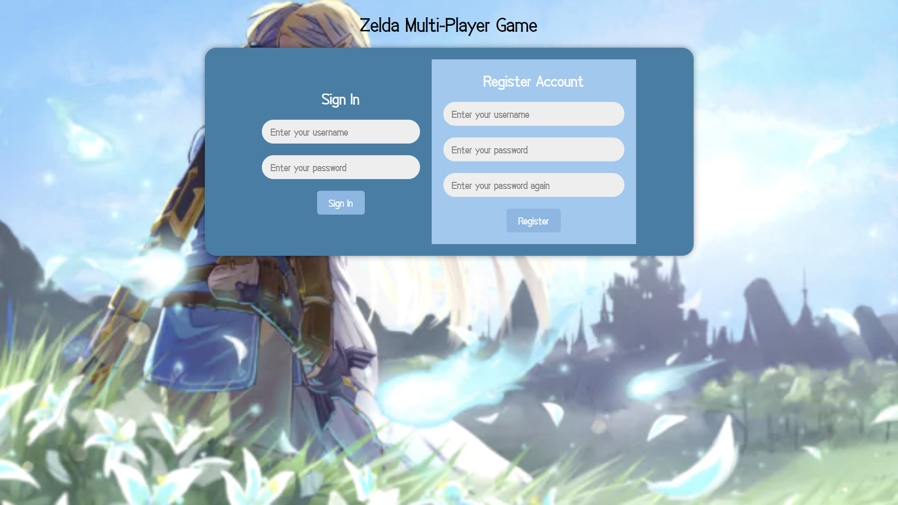

# Zelda-Multiplayer-Game

  
  
  
  

  
  
  

  

## Run Code
1. `npm install`
2. `node game_server.js`

[JQuery.com]: https://img.shields.io/badge/jQuery-0769AD?style=for-the-badge&logo=jquery&logoColor=white
[JQuery-url]: https://jquery.com 
[React-url]: https://img.shields.io/badge/React-blue?style=for-the-badge&logo=react&logoColor=white

